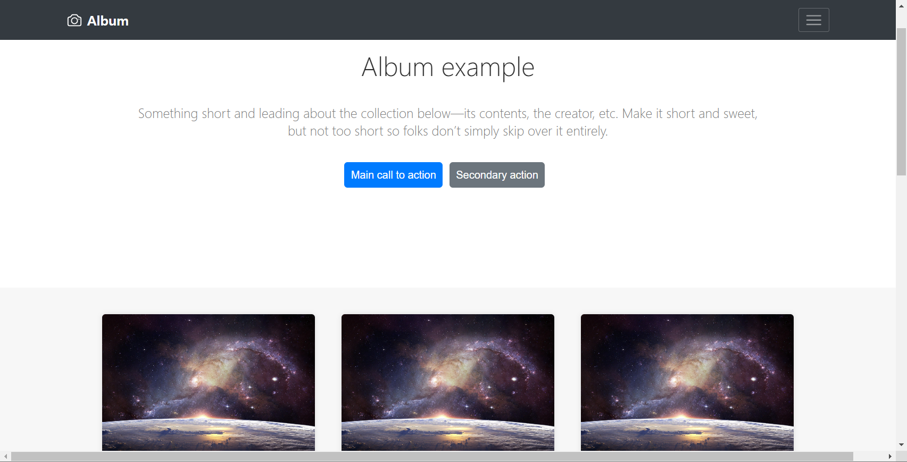
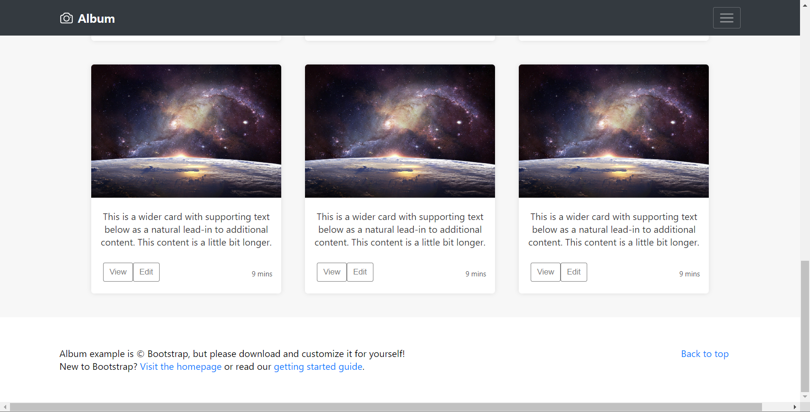

## 멋쟁이사자처럼 12기 클론코딩 과제

이번 시간에는 그동안 배운 styled component와 React hook(useState, useEffect)을 사용하여 직접 클론코딩을 진행해볼 겁니다.
이전 세션에 비해 다소 난이도가 올라갈 수 있으나 실제 구현되어있는 서비스를 직접 따라 만들면서 배우는 것만큼 빠르고 효과적인 공부법은 없으니까요.
모두 화이팅!

## 실습 진행방법

이번 주차는 과제 중심으로 세션이 진행됩니다!
직접 Component를 만들어서 아래의 홈페이지와 같은 페이지를 구현해보세요.

https://getbootstrap.com/docs/4.3/examples/album/

- Icon 이미지 가져오기 : https://heroicons.com

### 어른 사자의 길

1. 우측 상단 햄버거 버튼 클릭 시 진행되는 동적 기능
2. 기타 애니메이션 효과
3. 하단 Footer

## 구현 화면

(이곳에 구현한 이미지를 이곳에 첨부해주세요. 아래는 예시 이미지입니다.)

## 구현 조건

1. `components`, `assets`, `pages` 3개의 폴더로 구분하여 개발합니다.
   - components 폴더엔 내가 구현한 컴포넌트들을, assets 에는 이미지 파일들을, pages 에는 내가 보여줄 페이지 컴포넌트를 위치시킵니다.
2. 상단에 `Header`는 스크롤하여도 화면에 고정되어 보이도록 합니다.

## 컴포넌트 계층 구조

주된 컴포넌트인 헤더, 푸터, 포토카드(사진과 글이 있는 것), 버튼에 대해 어떤 계층으로 설계했는지 이곳에 작성해주세요. 그리고 자식 컴포넌트 들에 대해서 어떤 의도를 갖고 설계했는지(ex 정렬하기 위해서, border를 주기 위해서 등) 부담없이 간단하게 적으면 됩니다.  

### Header
맨 위쪽 고정된 짙은 회색의 헤더
- HeaderContainer  
기능: 모든 헤더 요소 담으면서 2개의 컨테이너를 양쪽에 배치(space-between),  
스크롤 내려도 위쪽에 고정
- HeaderLeft
기능: 헤더 왼쪽 요소(앨범 아이콘, 텍스트)
- HeaderRight
기능: 헤더 오른쪽 요소(햄버거 바 버튼 담는 컨테이너)
- HamburgerButton
기능: 햄버거 바 버튼 상세 설정

### Section
페이지 메인에 들어오면 가장 먼저 보이는 부분.  
큰 텍스트와 작은 텍스트, 그리고 2개의 버튼으로 구성되어 있다.
- SectionContainer  
기능: 섹션 요소를 담는 컨테이너, 가운데 정렬
- SectionTitle
기능: h1 글자 컨테이너 
- SectionText
기능: h3 글자 컨테이너 
- Button
기능: 버튼용 컴포넌트
buttonColor, buttonText를 통해 색상 및 텍스트 커스텀

### Card  
포토카드 하나를 구성할 수 있는 컴포넌트  
CardList에서 사용한다.
- CardContainer
기능: CardImage와 CardInfo 합치는 용도 컴포넌트
- CardActions
기능: CardInfo에서 버튼과 시간 정보만 배치하는 컨테이너.  
space-between 처리: 텍스트 뻬고 flex 처리하기 위해
- CardImage
기능: 이미지 담기
- CardInfo 
기능: 카드 정보 박스(텍스트, 버튼, 시간 정보 담아야 한다.)
- CardText
기능: 카드 이미지 및 텍스트 정보
- TimeInfo
기능: 시간 정보
- ButtonContainer
기능: 버튼 설정을 위한 컨테이너로 CardButton에서 사용한다.
- TimeInfoContainer
기능: 시간 정보 담을 컨테이너
- CardButton
기능: 버튼 2개 담을 컨테이너(뷰+에딧)

### CardList
포토카드 여러 개를 갤러리 처럼 보여주는 컴포넌트  
cardData 배열 안에 포토카드의 정보를 담을 수 있음.  
map을 이용해 cards 컨테이너에 담고 리스트로 내보낸다.  
imgSrc: 이미지 주소 정보, text: 이미지 텍스트 정보, timeInfo: 시간 정보
- CardListContainer
기능: flex wrap을 통해 3*3 모양으로 보여주기

### Footer
텍스트 링크 요소: text-decoration 옵션을 none으로 설정
- FooterContainer
기능: 모든 푸터 요소 담으면서 2개의 컨테이너를 양쪽에 배치
- FooterLeftConainter
기능: FooterLeft 담는 컨테이너, 왼쪽 배치
- FooterRightConainter
기능: FooterRight 담는 컨테이너, 오른쪽 배치
- FooterLeft
기능: 왼쪽 텍스트
- FooterRight
기능: 오른쪽 텍스트
